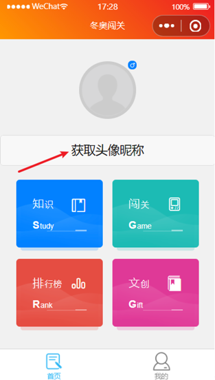
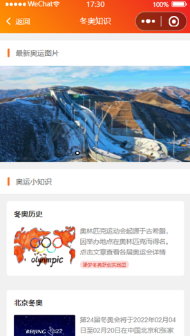
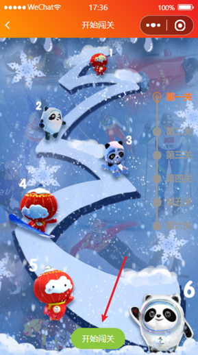
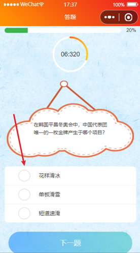
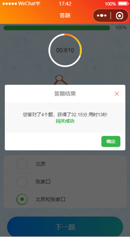
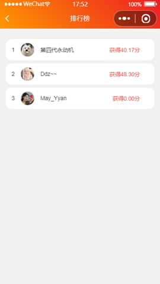

# 冬奥答题竞赛小程序 采用微信云开发
研发这个小程序的初衷和理念，是通过北科大缘梦冬奥跃创实践团，研制出“冬奥闯关”小程序，带动全社会参与冬奥、了解冬奥，从冬奥小知识的答题竞赛入手，带动全社会了解冬奥、认识冬奥，为冬奥的宣传工作添砖加瓦。

“冬奥闯关”小程序利用数字化的技术手段和科学的计算方法，按照“交互界面友好化、闯关体验趣味化”的原则，让用户实现趣味答题，在答题的同时也能体验到了解冬奥的快乐。

目前，“冬奥闯关”小程序碳积分主要通过答题闯关、冬奥知识科普、闯关分数排名、文创欣赏功能实现。
同时，为了增加趣味性，还设计了非常丰富的互动社交玩法。比如，邀请好友共同答题进行排名，组团了解冬奥争做冬奥达人。

# 游戏规则
这是冬奥答题小程序的游戏规则
- 分数：一共6关，每关5道题，一道题10分  时间权重为20%
  当前关总分数=0.8\*（10\*答对题目)+0.2\*(50-答题时间)

- 过关要求：答对4题以上

# 界面展示
点击进入后授权登录用户信息

点击知识区，对冬奥知识进行科普

点击闯关区，进行答题闯关，题目共有六关，每关随机抽取五道题，难度由容易到简单，通过上一关之后可以进行下一关

点击下方开始闯关进行闯关。右侧有进度条显示闯关进度

每题限时10秒，点击圆形选框进行选择，如果没有提交就会以0分自动提交显示下一题。
闯关成功即显示分数和用时，进行下一关的挑战

点击排行榜即可进行排名

